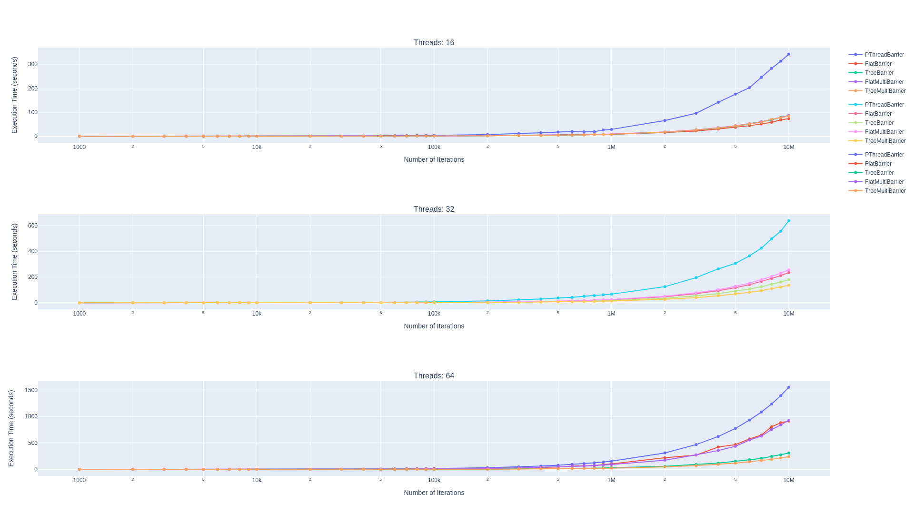

# Dynamic Barrier
This is no regular barrier. This is a dynamic barrier that allows threads to opt in/out of the barrier at runtime. The barrier is implemented (almost) purely using atomics. It is also faster than pthreads barriers by more than 60%.

## Barrier Types
- `FlatDynamicBarrier`: This is your typical barrier where all threads must reach the barrier before any thread can proceed. This barrier is templated to allow you to use any number of threads (I don't know if there any speed benefits of using atomics on smaller ints, but I did it anyway). The allowed sizes are:
  - `uint8_t`: 0-128 threads
  - `uint16_t`: 0-32768 threads
  - `uint32_t`: 0-2147483648 threads
- `TreeDynamicBarrier`: I noticed that with a large number of threads, the `FlatDynamicBarrier` was not as efficient as I would have liked. Especially since I use these mostly in loops. So I implemented a tree barrier where every group of threads meets at a leaf barrier, and only one of them proceeds to the next level. This is repeated until all threads have reached the top level. This is supposed to decrease ping-ponging of the atomic variable and decrease contention as a whole. For speed reasons, 
this requires a logical tid to be passed to each of its functions. This is currently not templated and only the following sizes are allowed:
  - 2 threads per node
  - 4 threads per node

## Usage
The library is header only. If you want, you can simply stick it in your project. Otherwise, you can install it through your CMake as follows:
```cmake
include(ExternalProject)
set(EXTERNAL_INSTALL_LOCATION ${CMAKE_BINARY_DIR}/external)
ExternalProject_Add(
    DynamicBarrier
    GIT_REPOSITORY https://github.com/mewais/DynamicBarrier.git
    CMAKE_ARGS -DCMAKE_INSTALL_PREFIX=${EXTERNAL_INSTALL_LOCATION}
)

target_include_directories(${PROJECT_NAME} PUBLIC ${EXTERNAL_INSTALL_LOCATION}/include)
```

The API is quiet simple:
```cpp
#include "DynBar/FlatDynamicBarrier.hpp"
#include "DynBar/TreeDynamicBarrier.hpp"

FlatDynamicBarrier<uint8_t> barrier(4); // 4 threads, none of them opted in
FlatDynamicBarrier<uint8_t> barrier(4, 2); // 4 threads, first 2 opted in
barrrier.OptIn(); // Increment the target by 1
barrier.OptOut(); // Decrement the target by 1
barrier.Arrive(); // Wait for all threads to reach the barrier

TreeDynamicBarrier barrier(16, 2); // 16 threads, a node size of 2
TreeDynamicBarrier barrier(16, 4, 2); // 16 threads, first 4 opted in, a node size of 2
barrrier.OptIn(tid); // Opt in logical thread id tid
barrier.OptOut(tid); // Opt out logical thread id tid
barrier.Arrive(tid); // Wait for all threads to reach the barrier
```

## Performance Comparison
The tree barrier outperforms the flat barrier when using a large number of threads. The differences become more noticeable the more they are used. Here's a preliminary comparison:


## License
This project is licensed under the MIT License - see the [LICENSE](LICENSE) file for details.
